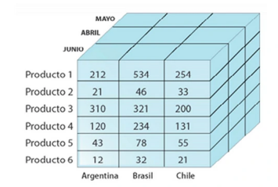

# Proyecto Final Cubo Olap Grupo 9

## Configuraciones
Definir la estructura para guardar toda la data necesaria para cargar el cubo
* urls de los archivos csv
* nombres para los archivos
* tipos de datos para las columnas de cada uno
* jerarquias de las dimensiones
* los hechos se manejan aparate
* definir los metricas asociadas a los hechos (suma, count, promedio, min, max) (ENUM)
* guardar las medidas asociadas a los tabla de hechos(cantidad, valor_unitario, valor_total, costo)
* metodos para obtener la info
* un contructor.
* se divide en 3 Sub - Configuraciones: Configuracion Cubo, Configuracion Dimension, ***Configuracion Proyeccion***

## Dimension
Definir la estrutura para manejar toda la informacion
* contructor para crear la dimension: completo e incompleto.
* datos necesarios para un dimension: nombre, tabla, jeraquias.
* tipos de datos asociados: nombre-columna -> tipo dato
* tipo de dato en ENUM
* getters de la data de la dimension.
* funcion de informacion de dimension

## Cubo
* Hechos
* lista de dimensiones
* metodos asociados: (crear proyeccion)
* crear metodo para cargar toda la informacion recibida por la configuracion.
* metodo de informacion del estado del cubo.
* crear proyecciones -> pendientes.

## Proyecciones
* Deberia los argumentos necesarios para poder crear una proyeccion especifica del cubo.
* definir como proyectar o la firma del constructor

## Definir una forma para proyectar lo siguiente
- [  ] proyeccion en 1 dimension (1 jerarquia).
- [  ] proyectar a dos dimension (1 jerarquia).
- [  ] definir como encarar las proyecciones bocetos.
- [  ] definir la clase proyeccion: atributos y metodos escenciales.

## Proyectar 1 dimension
* conseguir los hechos y la dimension en cuestion y fuisionarlos con las columnas apropiadas
    - Tabla unionHechosFechas = Tabla.joinTablas(hechos, tabla_dim, "id_fecha", "id_fecha");
* se obtiene una tabla general
* aqui muere lo que ahce cubo y comienza lo que hace proyeccion
* agrupar por la jerarquia que se indique, por ejemplo:
    - si en fechas recibe la jeraquia mas compleja anio, deberia hacer lo siguiente:
    - anio -> groupBy (["anio"]) < ----- FOCO
    - quarter -> groupBy(["anio", "quarter"])
    - mes -> groupBy(["anio", "quarter", "mes"])
* deberiamos obtenemos un diccionario con la lista de valores asociados a la combinacion posible.
* a la lista deberiamos transformarlos a una lista de String con la medida selecionada.
* conversion tipo de dato a double.
* y aplicar la metrica correspondiente.
* obtendriamos una columna o fila (depende la perspectiva) de una vista de 2 dimensiones.
* ampliar jerarquia (para despues)

1) hechos, tabla_dimension, columnas de join para justar los datos (son 2), 
2) y su jerarquias, funcion que represente la metrica y tranforme los datos, y el nombre de la medida a tener.

# Tareas pendientes
1) crear configProyeccion.
2) cubo desde crear proyecion1D deberia crear el join de la tabla general
3) proyeccion1D deberia recibir la tabla y generar la tabla consecuente a proyectar.

## Proyectar 2 dimensiones

* podria aplicarse lista de una dimension1D, basando en la jerarquia de la base del eje x.
* Map<String, Tabla> subtablas = tabla.groupBySubtablas(Arrays.asList("anio", "quarter"));
* proyectamos cada fila o columna.

## ***En todos los casos hay que crear semi Historias de Usuario y anotar los problemas e inconvenientes que vayan surgiendo.***

constructor vacio, que inicialice los tipos de datos de la clase, un constructor que use inicial, y modificque.
